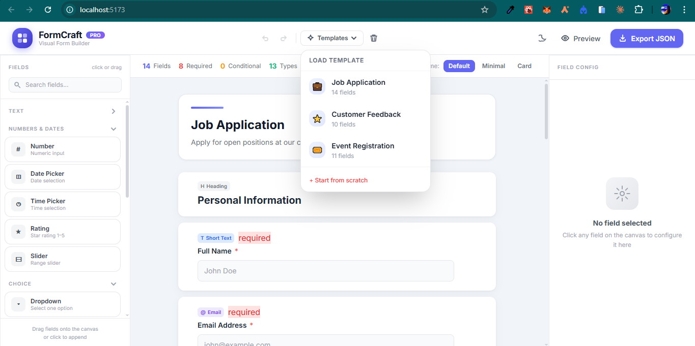

# FormCraft — Visual Form Builder

FormCraft is a professional, browser-based form builder that lets developers and designers visually construct forms without writing a single line of code. Drag fields onto a live canvas, configure validation rules and conditional logic per field, preview the form in real time, and export a standards-compliant JSON Schema (draft-07) ready to plug into any backend or validation library. Built entirely client-side with React, @dnd-kit, Zustand, and Tailwind CSS — no server, no database, no setup beyond `npm install`.

## Preview



## Features

- 20 field types across 4 categories (Text, Numbers & Dates, Choice, Media & Layout)
- Drag-and-drop field reordering with @dnd-kit
- Live form preview with conditional logic evaluation
- Dark / Light mode toggle
- Undo / Redo (Ctrl+Z / Ctrl+Y)
- JSON Schema draft-07 export with syntax highlighting
- 3 pre-built demo templates (Job Application, Customer Feedback, Event Registration)
- Fully responsive — mobile drawer sidebars, desktop 3-column layout
- Keyboard shortcuts: Ctrl+E (export), Ctrl+P (preview)

## Tech Stack

- React 18 + Vite
- Zustand (state management)
- @dnd-kit/core + @dnd-kit/sortable (drag and drop)
- Tailwind CSS v3
- UUID

## Getting Started

```bash
npm install
npm run dev
```

## Build

```bash
npm run build
```

## Deploy

Configured for Vercel — just connect the repo and deploy. No environment variables needed.

[](https://vercel.com/new)
